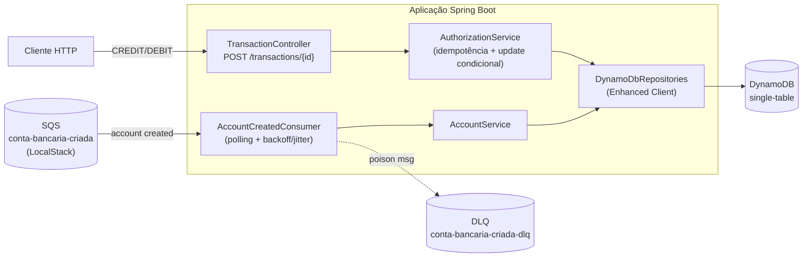
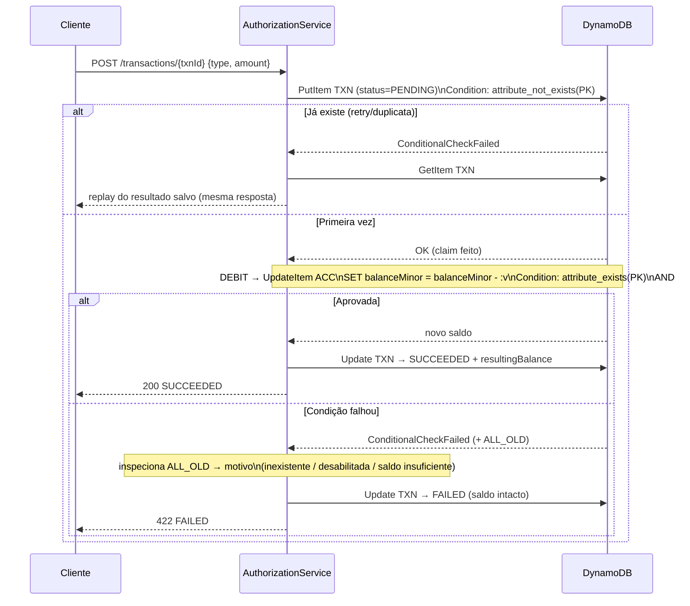
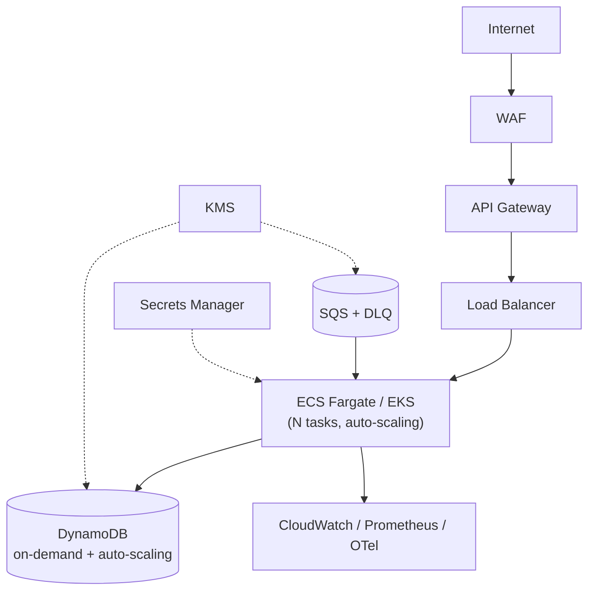
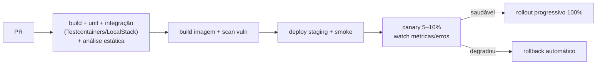

# Arquitetura — Autorizador de Transações

## 1. Visão de componentes

Dois pontos de entrada independentes (consumer e API REST), um repositório de persistência e o
DynamoDB como fonte única de verdade. Worker e API escalam separadamente.

## 2. Decisões-chave (resumo — detalhe em `adr/`)

| Tema | Decisão | ADR |
|---|---|---|
| Persistência | DynamoDB | [0001](adr/0001-persistence-dynamodb.md) |
| Concorrência | Claim + update condicional atômico | [0002](adr/0002-concurrency-conditional-update.md) |
| Idempotência | `transactionId` como chave | [0003](adr/0003-idempotency-transaction-id.md) |
| Dinheiro | Minor units + `BigDecimal` | [0004](adr/0004-money-minor-units.md) |
| Modelagem | Single-table + GSI | [0005](adr/0005-single-table-design.md) |
| Status da conta | Recusa transação se != ENABLED | [0006](adr/0006-account-status-gating.md) |
| Dev local | Dois composes + init | [0007](adr/0007-local-dev-topology.md) |
| Deploy/pipeline | Fargate + canary | [0008](adr/0008-deploy-and-pipeline.md) |

## 3. Fluxo de autorização (núcleo)

O par **idempotência + update condicional atômico** resolve, juntos, *at-least-once delivery /
client retry* e *race condition no saldo*.

**Por que assim:**
- `ConditionExpression` **é** o "update condicional atômico" — sem lock, sem read-modify-write,
  sem janela de race. Débito que estouraria o saldo falha atomicamente e **não altera o saldo**.
- A condição única guarda **existência + status + saldo**; `ReturnValuesOnConditionCheckFailure:
  ALL_OLD` devolve o item no erro, permitindo distinguir o motivo do FAILED **sem leitura extra**.
- O *claim* `PENDING` com `attribute_not_exists` garante idempotência sob retry/duplicata:
  reprocessar devolve o **mesmo** resultado, nunca dobra saldo.

## 4. Consumer SQS resiliente

- **Idempotência:** `PutItem` da conta com `attribute_not_exists(PK)` → redelivery não recria/zera saldo.
- **DLQ** com `maxReceiveCount` → poison messages saem do fluxo sem travar o consumer.
- **Resilience4j:** `Retry` com **exponential backoff + full jitter**; `CircuitBreaker` no acesso ao Dynamo.
- **Visibility timeout** > p99 do processamento; deleção da mensagem só após sucesso (at-least-once consciente).
- **Throughput:** recebe em lotes (até 10), processa concorrente com backpressure controlado — precisa drenar a rajada de 100k.
- **Validação** do payload (allow-list): `id`/`owner` UUID, `status` ∈ enum, `created_at` string-epoch válida.

## 5. Resiliência (resumo)

| Pattern | Onde | Lib |
|---|---|---|
| Retry + backoff + full jitter | consumer SQS, escritas Dynamo | Resilience4j |
| Circuit Breaker | acesso a DynamoDB | Resilience4j |
| Time Limiter / timeouts | toda chamada I/O | Resilience4j |
| Idempotência | POST + consumer | conditional writes |
| DLQ | mensagens não processáveis | SQS |
| Bulkhead (opcional) | isolar pools consumer vs API | Resilience4j |

## 6. Observabilidade

- **Logs** ✅ *implementado*: estruturados (JSON) via Logback + `logstash-logback-encoder`, com
  **requestId** no MDC (filtro HTTP + por mensagem no consumer). **Nunca** logar dados sensíveis
  (`owner`, valores) — em contexto financeiro são potencialmente PII. Perfil `local` mantém log legível.
- **Métricas** ✅ *implementado*: via Micrometer → Prometheus (Actuator). Métricas de negócio
  (`authorizations.total` com tags `type`/`status`/`reason`; `accounts.registered.total` com tag
  `result`) — tags de baixa cardinalidade, sem identificadores. Mais defaults (JVM/HTTP) e do circuit
  breaker (Resilience4j). **Pendente**: lag da fila SQS.
- **Tracing** 📋 *proposto*: OpenTelemetry ligando "mensagem SQS → escrita Dynamo" e
  "POST → autorização". Ainda não incluído nas dependências.
- **Health** ✅ *implementado*: Actuator com probes `liveness`/`readiness`. O grupo `readiness` inclui
  `HealthIndicator` customizados que validam conectividade real com **DynamoDB** (describeTable) e
  **SQS** (getQueueUrl) — sem expor detalhes internos de erro. `liveness` segue só com `livenessState`.

## 7. Segurança transversal

- **Sem credenciais hardcoded** — nem no compose. Local: env vars (`test/test` do LocalStack);
  cloud: IAM roles + Secrets Manager.
- **IAM least privilege:** só `sqs:ReceiveMessage/DeleteMessage` na fila e
  `dynamodb:GetItem/PutItem/UpdateItem/Query` na tabela — nada de `*`.
- **Criptografia:** at-rest (KMS no Dynamo/SQS) e in-transit (TLS).
- **Input validation** no controller (Jakarta Bean Validation, allow-list) → handler global
  retorna mensagem genérica, **sem stack trace** vazando.
- **SDK AWS parametrizado** (Enhanced Client / expression attribute values) — nunca montar
  expressão concatenando input do usuário.

## 8. Deploy em cloud pública

Compute: **Fargate** (serverless containers, escala por CPU/lag de fila). Dynamo on-demand absorve picos.

## 9. Pipeline e estratégia de deploy

Mitiga "bug afetar todos os clientes" via **canary com rollback automático**.

